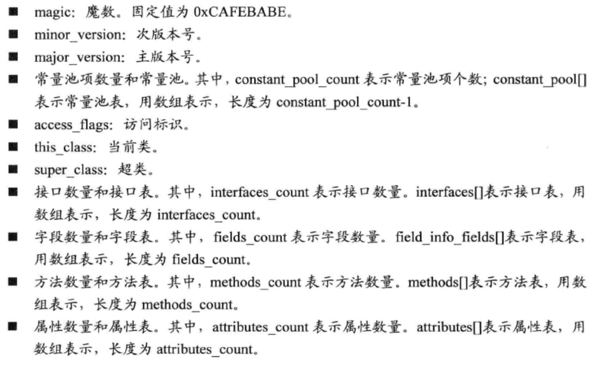
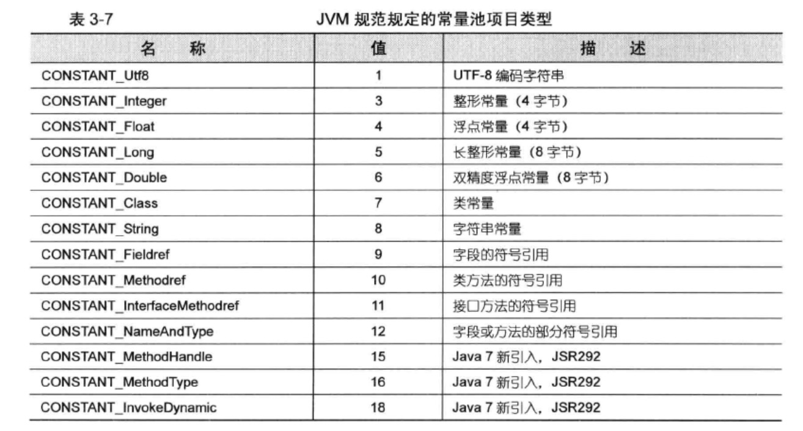
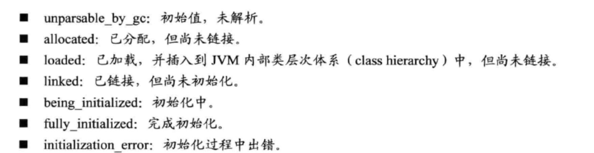
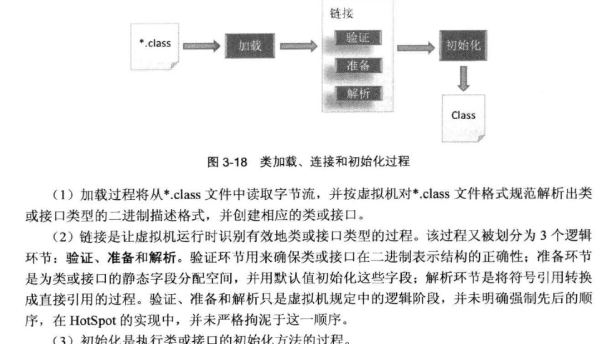
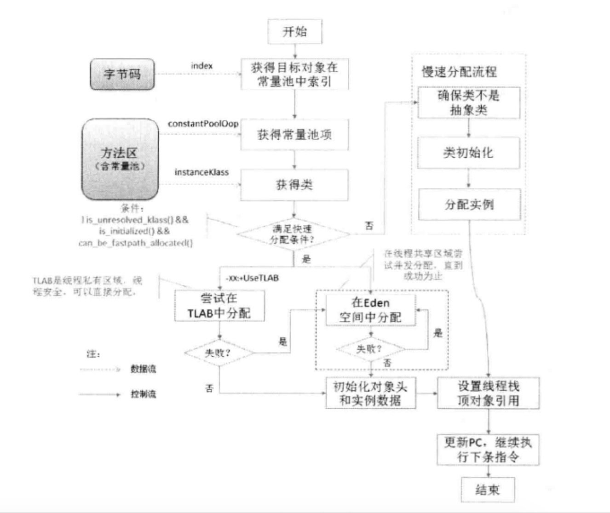

####3.1对象表示机制
#####3.1.1 OOP-CLASS 二分模型
#####3.1.2 Oops模块
#####3.1.3 OOP框架与对象访问机制
#####3.1.4 Klass与instanceKlass
#####3.1.5 实战:用HSDB调试HotSpot

---
####3.2类的状态转换
#####3.2.1 入口:class文件
######&emsp;&emsp;Class文件的各个组件的含义:

---
>Class文件
>>常量池
>>>常量池中持有class文件中引用的所有字符串常量、类名、接口名、字段名、方法名和其他字符信息

---
>>字段表
>>>描述接口或类中的字段。字段包括类字段(static Field即类变量)或实例字段(non-static Field即非静态变量)。字段表需要描述字段的如下信息:
>>>* 作用域(public private protected)
>>>* static
>>>* final
>>>* volatile
>>>* transient
>>>* 类型，基本类型，对象或数组
>>>* 名称 
---
>>方法表
>>>描述实例初始化方法和类初始化方法
---
>>属性表
>>>虚拟机将属性表设计成一个具有良好可扩展性的逻辑结构，可以为JavaSE版本升级提供良好的支持。当Java需要实现新的特性时，可以补充相应的属性，通过编译器传递给虚拟机 
>>>JAVA7的虚拟机规范中已经定义了约20种属性
>>>* ConstantValue:常量字段
>>>* Code:保存方法、实例类初始化方法或类初始化方法的虚拟机指令信息
>>>* StackMapTable:类验证阶段使用，验证局部变量期待的类型与操作数栈的实际类型是否一致
>>>* Exceptions:一个方法可以抛出的异常
>>>* InnerClass:内部类
>>>* EnclosingMethod:可选属性，表示局部类或者匿名类所属的外部方法
>>>* Signature:可选属性，表示类的泛型签名信息
>>>* SourceFile:可选属性，源文件名
>>>* LineNumberTable:可选属性，表示源代码的行号与字节码指令对应关系的表
>>>* LocalVariableTable:可选属性，描述局部变量
#####3.2.2 类的状态
######JVM内部定义的类状态

######类的状态转换

#####3.2.3 加载
>>1.初始化类加载器 
>>2.加载(从class文件字节流中提取类型信息)

加载阶段完成后，虚拟机j就在方法区为该类建立了类元数据。当需要时，就可以根据类元数据创建该类实例、访问类变量或调用类方法了
#####3.2.4 链接
#####3.2.5 初始化
#####3.2.6 实战:类的"族谱"
#####3.2.5 实战:系统字典

---
####3.3 创建对象
#####3.3.1 实例对象的创建流程

>创建流程说明: 
&emsp;&emsp;如果在实例分配之前已经完成了类型的解析,那么分配工作仅仅是在内存空间中划分可用内存，因此能以较高效率实现内存分配,故称为:快速分配
>>1.快速分配 
>>&emsp;&emsp;TLAB 
>>&emsp;&emsp;&emsp;&emsp;每个线程,JVM在Eden区开辟了一小块线程私有的区域。首先尝试在TLAB中分配,因为TLAB是线程私有区域,故不需要加锁便能保证线程安全。在分配一个新的对象空间时，将首先尝试在TLAB空间中分配对象空间，若分配的空间请求失败，再尝试使用加锁机制在Eden区分配对象 
>>&emsp;&emsp;选择Eden空间 
>>&emsp;&emsp;&emsp;&emsp;若失败则尝试在共享的Eden区进行分配,Eden区是所有线程共享区域，需要保证线程安全，故采用原子操作进行分配。若分配失败，则再次尝试该操作，直到分配成功为止 
>>2.慢速分配 
>>&emsp;&emsp;分配实例之前需要对类进行解析,确保类以及依赖类已得到正确的解析和初始化
#####3.3.2 实战:探测JVM内部对象

---
####3.4小结

