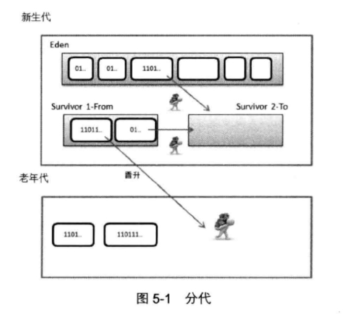

### 5.1 堆与GC
#### 5.1.1 垃圾收集
###### 释放不再被使用的对象所占空间的过程称为垃圾收集
###### 实现一款垃圾收集器，首先要明确它的主要任务
* 确保仍被引用的对象在内存中保持存在
* 回收无任何引用的对象所占的内存空间
###### 在堆中找到一块指定大小的未使用的内存块,比较困难。原因在于：选择的动态内存分配算法需要在避免内存碎片的同时还要兼顾分配与回收的效率
##### 垃圾收集器的性能指标主要包括以下几项
* 吞吐量:应用程序运行时间/(应用程序运行时间+垃圾收集时间)
* 垃圾收集开销：与吞吐量相对，这表示垃圾收集耗用时间占总时间的比例
* 暂停时间：在垃圾收集操作发生时，应用程序被停止执行的时间
* 收集频率：相对于应用程序的执行，垃圾收集操作发生的频率
* 堆空间：堆空间所占内存大小
* 及时性：一个对象由成为垃圾到被回收所经历的时间

##### 垃圾收集算法
> 标记-清除(Mark-Sweep)算法
>> 标记阶段：标记出所有可以回收的对象 
>> 清除阶段：回收所有已标记的对象，释放这部分空间

> 复制(Copying)算法
>> 将内存区域按比例划分为1个Eden区作为分配对象的"主战场"和2个幸存区(Suvivor空间) 
>> 复制：收集时，打扫"战场"，将Eden区中仍存活的对象复制到某一块幸存区中 
>> 清除：由于上一阶段已确保仍存活的对象已被妥善安置，现在可以"清理战场"了，释放Eden区和另一块幸存区 
>> 晋升：若在"复制"阶段，一块幸存区接纳不了所有"幸存"的对象，晋升到老年代

> 标记-压缩(Mark-Compact)算法
>> 标记阶段：标记出所有可以回收的对象
>> 压缩阶段：将标记阶段的对象移动到空间的一端，释放剩余的空间

#### 5.1.2 分代收集
###### 分代收集是指在内存空间中划分不同的区域，在各自区域中分别存储不同年龄的对象。每个区域可根据自身的特点灵活采取适合自身的收集策略。
##### 根据存储对象年龄的不同，可将分代分为3种类型:
* 新生代 
* 老年代 
* 永久代 

###### 一般情况下，对象将在新生代下进行分配。Eden区是新生代分配空间的主要区域。当Eden区内存消耗殆尽，无法满足新的对象分配请求时，将触发新生代的收集，即Minor Collection
###### 在新生代的收集过程中，幸存区用来提供一个暂存存活对象的区域。在"复制"环节，由一块幸存空间容纳收集过程中发现的幸存对象，它们将从Eden区被"搬运"至这块幸存空间中。若一块幸存空间不能容纳所有幸存对象时，允许一部分对象被直接"搬运"至老年代，这个过程成为"晋升"(Promotion)
###### 一般来说，首先触发Minor Collection 回收新生代。当老年代已经被填满，以至于无法接受本应从新生代晋升到老年代的对象。在此情形下，将触发Full Collection，使用老年代收集算法对整个堆进行回收(CMS收集器除外，CMS老年收集算法不会对新生代进行收集)
###### JVM通过两类参数判断对象是否可以晋升到老年代
* 年龄：在Minor Collection后仍然存活的对象，其经历的Minor Collection次数，就表示该对象的年龄
* 大小：对象占用的空间大小

#### 5.1.3 快速分配
###### bump-the-pointer 是一种线性分配技术。垃圾收集器在完成GC后，内存空间中已使用和未使用的内存块是相对独立并且地址连续的。收集器在内部维护了一个记录上一次分配对象的末尾指针，当需要分配新的对象时，检查剩余空间能否满足新对象的分配，如果满足的话，则只需要移动指针就可以完成空间分配，所以效率很高
###### HotSpot采用的是线程局部分配缓存技术(TLAB),每个线程都有自己的TLAB,位于Eden空间中的一小块空间。因为每一个TLAB是仅对一个线程可见，所以分配操作可以使用bump-the-pointer技术快速完成，而不必使用任何锁机制。只有当线程将TLAB填满并且需要获取一个新的TLAB时，同步才是必须的。

#### 5.1.4 栈上分配和逸出分析
减少新生代收集的次数，间接提高JVM性能
* 逸出分析
##### 分析局部变量的作用域仅局限于方法内部，则JVM直接在栈帧内分配对象空间，避免在堆中分配。这个分析过程称为逸出分析
* 栈上分配
##### 栈帧内分配对象的方式称为栈上分配
### 5.2 垃圾收集器
#### 5.2.1 设计演进
* 根据不同分代的特点，收集器可能不同。新生代收集器收集频率较高，应当选用性能高效的收集器；而老年代收集器收集次数相对较少，但对空间较为敏感，应当避免选择基于复制算法的收集器
* 垃圾收集的执行时刻，应用程序需要暂停执行
* 可以串行收集也可以并行收集
* 如果能做到并发收集(应用程序无需暂停)，那是很妙的事情
* 如果收集行为可控，也很妙
* 收集器的类型决定了堆的类型
#### 5.2.2 CMS
[CMS_GC问题探究](./network/CMS%20GC问题探究.htm)

