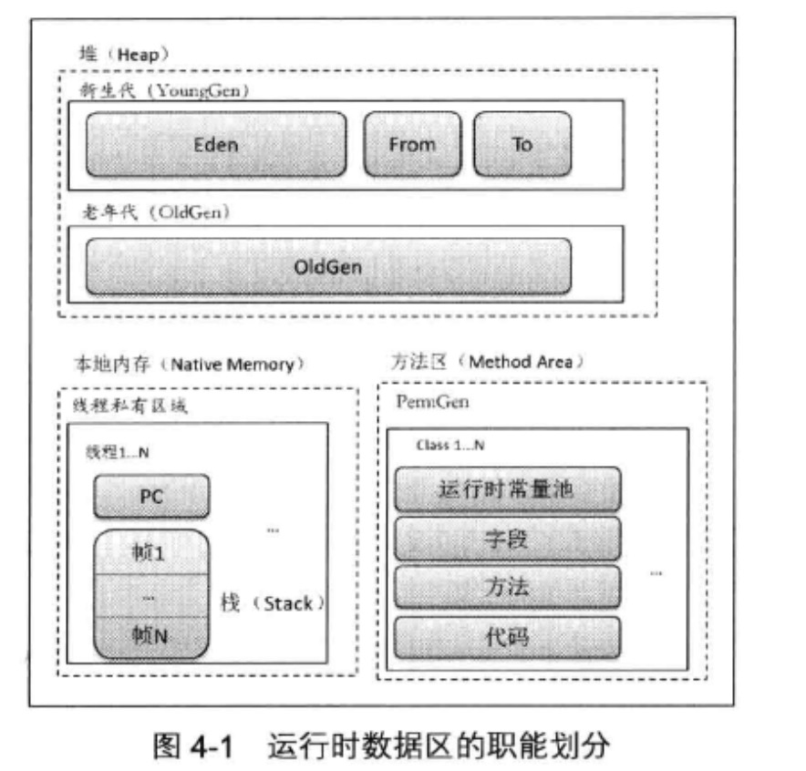
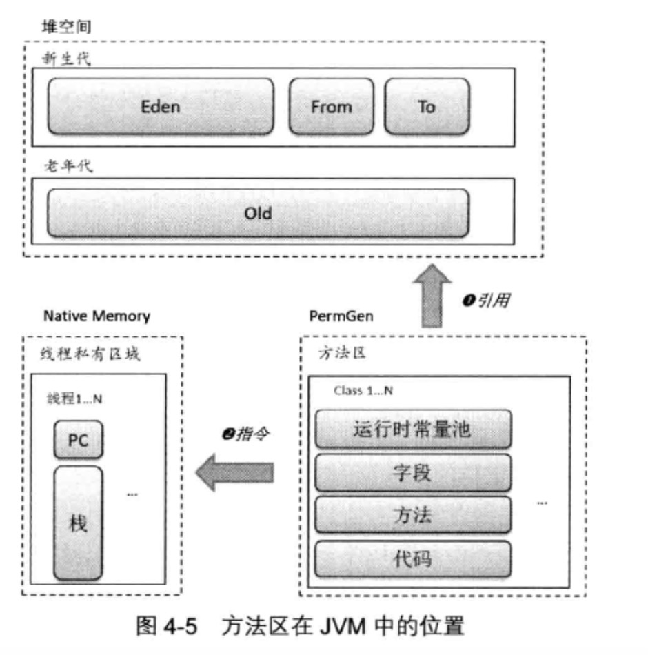

#### 4.1堆
##### 4.1.1 Java的自动内存管理
###### 虚拟机中内存空间按照内存的用途,可以划分为以下几个区域。
###### 堆:用于对象的分配空间.按照对象的年龄,又进一步划分为新生代和老年的的区域
###### 非堆:包括方法区和code cache.

##### 4.1.2 堆的管理
>分代 
>>分代收集是指在不同的内存空间分配不同的区域，分别存储不同年龄的对象，各自区域可根据自身的特点灵活采取收集策略 
---
>>新生代
>>>位于堆空间,划分为1个Eden区和2个幸存区(Suvivor),其中一个成称为from区,另一个则称为to区 
---
>>老年代
>>>位于堆空间,
>>永久代
>>>位于非堆空间

---
#### 4.2线程私有区域
###### 除了像堆这样的共享空间外，系统还为每个线程准备了独享空间：PC寄存器和栈。这部分内存空间是为线程的函数调用栈服务的。在JVM运行期间，每个线程的PC和栈都只能由所属线程独自支配。栈反应了程序运行位置的变化，而PC寄存器反映的是所执行指令的变化情况。

##### 4.2.1 PC
###### 线程启动时,JVM会为每个线程分配一个PC寄存器(Program Counter,即程序计数器)。为了模拟一个栈结构，虚拟机的设计者们必须提供一套能够保存指令地址的机制。HotSpot实现中，为每个线程分配一个字长的存储空间。JVM可以支持多条线程同时执行，每一个JVM线程都有自己的PC寄存器。在任意时刻，一个线程只能执行一个方法的代码，这个正在被线程执行的方法称为该线程的当前方法。如果当前执行方法不是本地方法，那么PC寄存器就保存JVM正在执行的字节码指令的地址。如果当前方法是本地方法,PC寄存器中的值是未定义的。

##### 4.2.2 JVM栈
###### 每一个Java线程都有自己私有的Java虚拟机栈，这个栈与线程同时创建，用于存储栈帧.JVM栈用于存储方法执行中的局部变量、中间演算结果以及方法返回结果。当进入一个方法时，在栈顶分配一个数据区域。退出时，撤销该数据区。
###### Java虚拟机栈可能发生以下两种异常情况:
* 如果线程请求分配的栈容量超过Java虚拟机允许的最大容量时,JVM会抛出一个StackOverflowError异常
* 如果JVM栈可以动态扩展，在扩展后的栈空间中仍然无法满足内存分配请求,或者在建立新的线程时没有足够的内存去创建JVM栈，那么JVM会抛出一个OutOfMemorryError异常
---
#### 4.3方法区
######方法区由虚拟机的所有线程共享。方法区存储每个类的结构信息。例如：
* ###### 常量池
* ###### 域
* ###### 方法数据
* ###### 方法和构造函数的字节码
* ###### 类、实例、接口初始化时用到的特殊方法

##### 4.3.1 纽带作用
###### 堆提供存储JAVA程序所创建的场所;栈提供执行线程在方法调用中使用到的方法参数、局部变量和中间结果等信息.
###### 方法区承载了Java类的字段和字节码，通过引用堆中对象以及围绕栈进行操作的JVM指令，将各个内存逻辑区域有机的联系起来,成为联系各区域进行协作的纽带
###### 对于给定的类型(类和接口),在方法区中需要存储的信息至少应包含两大类数据：类型基本描述信息和域[字段域和方法域]信息.

###### 栈帧按照方法的要求存放对象引用。栈帧是为方法服务的，方法在执行时需要使用哪个对象，就直接访问栈帧指定位置即可.
##### 4.3.2 常量池
###### 虚拟机在创建一个类或接口时，将按照类或接口在class文件中的定义建相应的常量池
###### 常量池的出现，解决了JVM定位字段和方法的问题。它在不破坏指令集的简洁性的前提下，仅通过少量字节就能够定位到目标。但是，若每次字段或方法的访问都需要解析常量池项的话，将会不可避免地会造成性能下降

##### 4.3.3 常量池缓存
###### 常量池缓存由一个数组组成，元素类型是常量池缓存项，每个缓存项表示类中引用的一个字段或者方法
##### 4.3.4 方法的表示
##### 4.3.5 方法的解析(将符号引用转换为直接引用)
1. ###### 何时触发解析
###### JVM规范规定,指令anewarray checkcast getfield getstatic instanceof invokedynamic invokeinterface invokespecial invokestatic invokevirtual ldc ldc_w multianewarray new putfield将符号引用指向运行时常量池。当执行到上述指令时,需要对它的符号引用进行解析

##### 4.3.6 代码放在哪里
##### 4.3.7 实战：探测运行时常量池

---
##### 4.4 性能监控数据区
###### 4.4.1 描述这段空间
###### 4.4.2 查看
###### 4.4.3 生产

---
##### 4.5 转储
###### 4.5.1 用VisualVM进行转储

###### 4.5.2 JVM Crash
###### [hs_err_pid.log解读](./network/hs_err_pid.log解读.html)
###### [hs_err_pid20012.log](./network/hs_err_pid20012.log)

---

##### 4.6 小结

